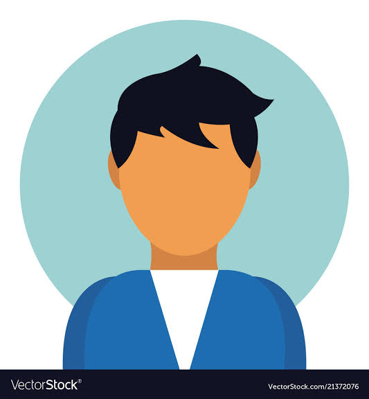

# Currently working on

| Front-End             | Back-End                | Graphics     |
| --------------------- | ----------------------- | ------------ |
| It must have an image | another image goes here | the last one |

</ceter>

<!-- add elements that can be changed frequently -->

| 
  
 |   |    |
| --------------------------------------------------------------------------------------------------------------------------------------------------------------------------------------------------- | --------------------------------------------------------------------------------------------------------------------------------------------------------------------------------------------------- | ----------------------------------------------------------------------------------------------------------------------------------------------------------------------------------- |

# Reach me

# Collaboration

# Projects

# Tools

# Stats

# Donations

Front-end

Backend

Footer

License

* 🌱 I’m currently learning ... Android Apllication Delopment, HTML, Python, CSS, XML, SVG, javascript,
