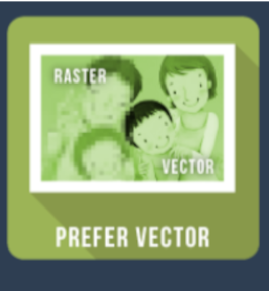
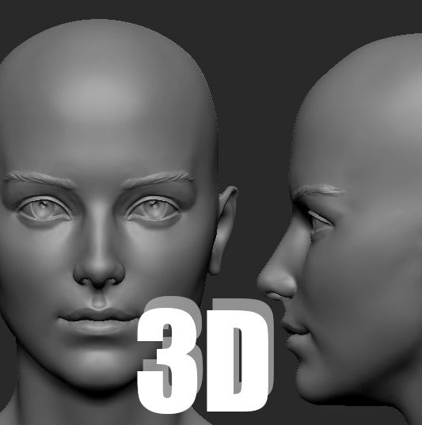
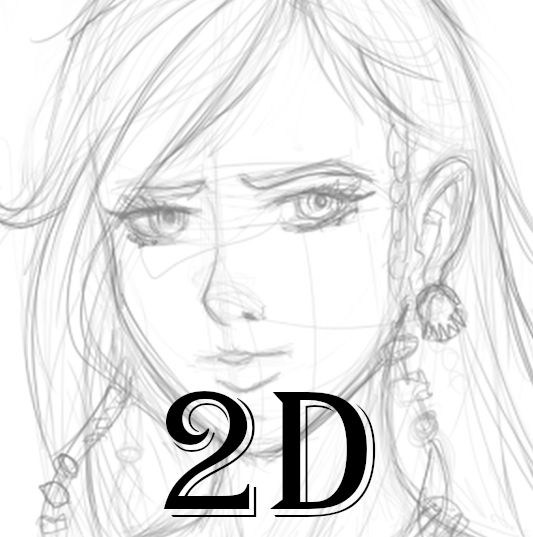
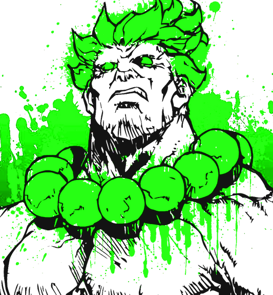

# Currently working on

<!-- This is a test -->

- Create products for portfolio

# **About**

| [
](#front-end)  
 |   |    |
| --------------------------------------------------------------------------------------------------------------------------------------------------------------------------------------------------------------------------------------------- | ------------------------------------------------------------------------------------------------------------------------------------------------------------------------------------------------------------------------------------------------------------- | -------------------------------------------------------------------------------------------------------------------------------------------------------------------------------------------------------------------------- |

# Reach me

# Footer

 subscribe to my <a href=""> Newsletter </a> 

# License

|  | To the extent possible under law,  [Kshitij Satpathy](https://creaator-afk.github.io/)  has waived all copyright and related or neighboring rights to this work. |
| ------------------------------------------------------------------------------------------------------------- | ---------------------------------------------------------------------------------------------------------------------------------------------------------------------- |

